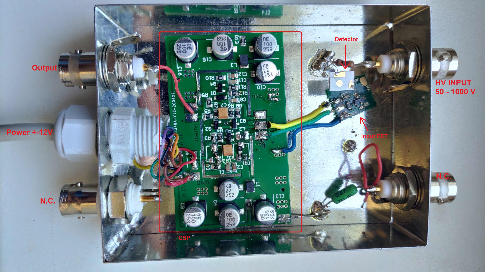
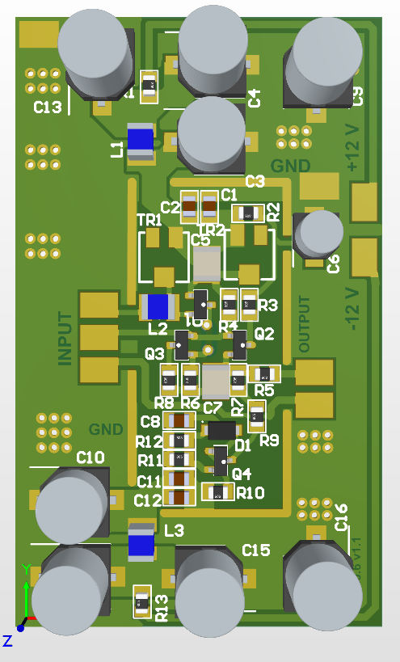
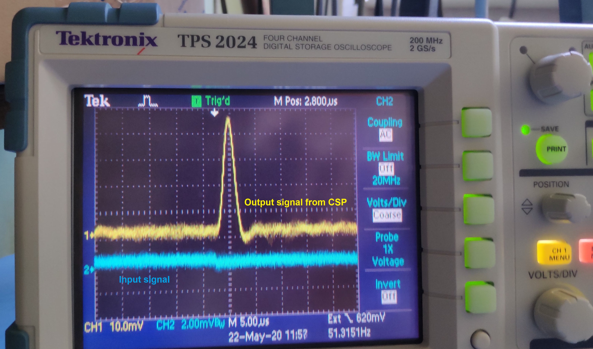

# ChargeSensitivePreamplifier

This repository includes charge sesnsitive preamplifier schematic and pcb design in Altium designer and simulations in LTspice.

### Simulations ####

All simulations made in free [LTspice XVII](https://www.analog.com/en/design-center/design-tools-and-calculators/ltspice-simulator.html)

**Power_filter.asc** --------> Various power supply filtering with cap, res, indc.\
**CSP_with_resistor.asc** --> Standard CSP with feedback resistor.\
**CSP_DC_coupling.asc** --> CSP without feedback resistor with DC coupled detector\
**CSP_AC_coupling.asc** --> CSP without feedback resistor with AC coupled detector\

### Results ###
coming soon...

### PCB ###
 
 
 
